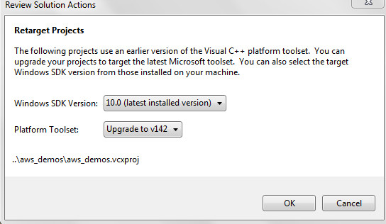

#   aws_demos pc version with master version (Latest commit ee50e8d)
- Step1:  Create workfolder: C:\mori_amazon_freertos  , then cd to this folder  
- Step2:  Gitbash, run commonad: git clone --recursive https://github.com/aws/amazon-freertos.git  

- Step2:  Build aws_aws pc version. Using Visual studio 2019  
          open C:\mori_amazon_freertos\amazon-freertos\projects\pc\windows\visual_studio\aws_demos\aws_demos.sln  
            
          set to update the SDK as the picture above, click button "OK"  
         
          build succeeded!!   
           1>aws_demos.vcxproj -> C:\mori_amazon_freertos\amazon-freertos\projects\pc\windows\visual_studio\aws_demos_sdk10\.\Debug\aws_demos.exe  
           1>Done building project "aws_demos.vcxproj".  
           ========== Rebuild All: 1 succeeded, 0 failed, 0 skipped ==========  

          

## For reference how to install windows 8.1  (win7)  
- step 1:  https://developer.microsoft.com/ja-jp/windows/downloads/sdk-archive/  
- step 2:  Windows 8.1 SDK  
- step 3:  You have to restart after install 

## how to clone submodules  
submoduleで管理しているライブラリをcloneし忘れた 
git clone --recursive {gitリポジトリurl}  
Other links: https://git-scm.com/book/en/v2/Git-Tools-Submodules  
https://stackoverflow.com/questions/9357442/github-linking-with-other-repos  

