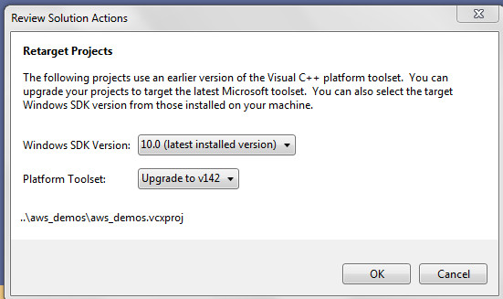
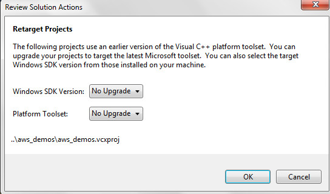
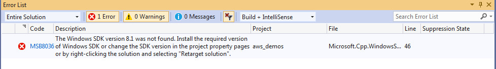

# Note 
## Build aws_demos pc version with 201912.00  branch
- Step1:  Create workfolder: C:\mori_amazon_freertos  , then cd to this folder  
- Step2:  Gitbash, run commonad: git clone --recursive https://github.com/aws/amazon-freertos.git  
- step3:  $ git checkout 201912.00
            error: The following untracked working tree files would be overwritten by checkout:  
            vendors/espressif/esp-idf/.editorconfig  

          So, you change to use: 
          git checkout -f 201912.00 
          output result: ems@ems-PC MINGW32 /c/mori_amazon_freertos/amazon-freertos ((201912.00))
  
  
          
- Step3:  checkout brach, git checkout 201912.00    
          you can verfiy all the branched downloaded installed in your local folder as:  
          $ git branch  
            * (HEAD detached at 201912.00)  
            master  
- Step4:  Build aws_aws pc version. Using Visual studio 2019  
          Because the demo project use SDK8.1, please refter the sector below "how to install windows 8.1  (win7)  "  to pre-install SDK8.1  
          C:\mori_amazon_freertos\amazon-freertos\projects\pc\windows\visual_studio\aws_demos\aws_demos.sln   
           
          set to the SDK as following  
              

## Build aws_demos pc version with master version (Latest commit ee50e8d 2 days ago)
- Step1:  Create workfolder: C:\mori_amazon_freertos  , then cd to this folder  
- Step2:  Gitbash, run commonad: git clone --recursive https://github.com/aws/amazon-freertos.git  
- step3:  $ git checkout 201912.00
            error: The following untracked working tree files would be overwritten by checkout:

- Step3:  checkout brach, git checkout 201912.00    
          you can verfiy all the branched downloaded installed in your local folder as:  
          $ git branch  
            * (HEAD detached at 201912.00)  
            master  
- Step4:  Build aws_aws pc version. Using Visual studio 2019  
          open C:\mori_amazon_freertos\amazon-freertos\projects\pc\windows\visual_studio\aws_demos\aws_demos.sln  
           
          set to update the SDK as following  
             

          build successful  
           1>aws_demos.vcxproj -> C:\mori_amazon_freertos\amazon-freertos\projects\pc\windows\visual_studio\aws_demos_sdk10\.\Debug\aws_demos.exe  
           1>Done building project "aws_demos.vcxproj".  
           ========== Rebuild All: 1 succeeded, 0 failed, 0 skipped ==========  

          **Note:** if you select no update as following  
             

          Then rebuild the project  , there will be error below, because the current pc doesn't have SDK 8.0 which is used by this demo project(asw_demo) 
            
          

# how to install windows 8.1  (win7)  
- step 1:  https://developer.microsoft.com/ja-jp/windows/downloads/sdk-archive/  
- step 2:  Windows 8.1 SDK  
- step 3:  You have to restart after install 

# how to clone submodules  
submoduleで管理しているライブラリをcloneし忘れた 
git clone --recursive {gitリポジトリurl}  
Other links: https://git-scm.com/book/en/v2/Git-Tools-Submodules  
https://stackoverflow.com/questions/9357442/github-linking-with-other-repos  

